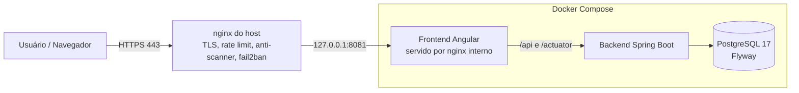
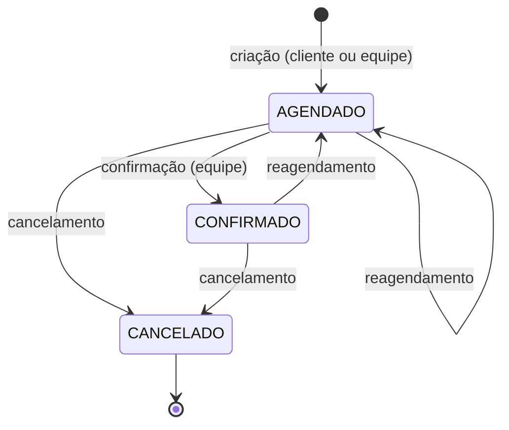
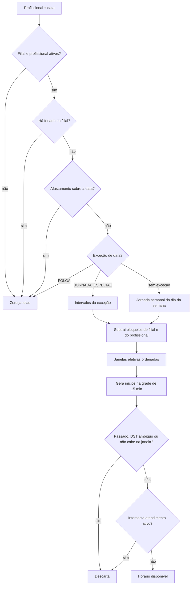
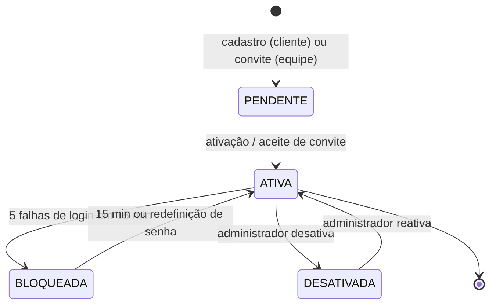
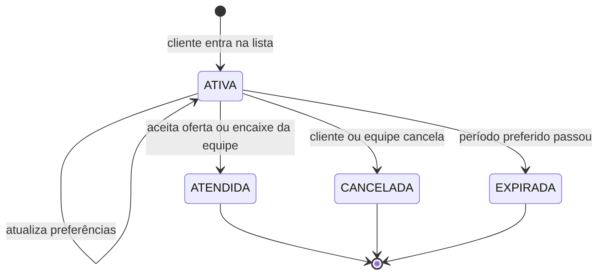
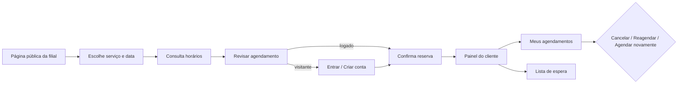
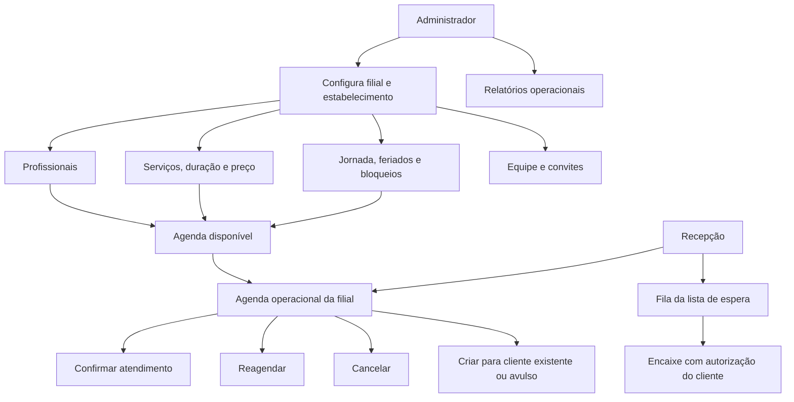
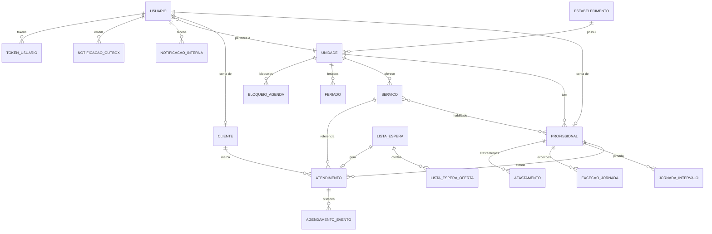

# Estilo Marcado

> Plataforma web de agendamento e gestão para salões de beleza e barbearias.

- **Aplicação em produção:** <https://estilomarcado.samuelsantos.qzz.io>
- **Repositório:** <https://github.com/samuel06santos/dsai-ap1-EstiloMarcado>

---

## Sumário

1. [O que é e para que serve](#1-o-que-é-e-para-que-serve)
2. [Problema que resolve](#2-problema-que-resolve)
3. [Perfis de usuário](#3-perfis-de-usuário)
4. [Funcionalidades](#4-funcionalidades)
5. [Como o sistema funciona (fluxo completo)](#5-como-o-sistema-funciona-fluxo-completo)
6. [Diagramas de usuário e usabilidade](#6-diagramas-de-usuário-e-usabilidade)
7. [Arquitetura e stack](#7-arquitetura-e-stack)
8. [Modelo de dados](#8-modelo-de-dados)
9. [API REST](#9-api-rest)
10. [Segurança](#10-segurança)
11. [Testes e qualidade](#11-testes-e-qualidade)
12. [Como rodar (desenvolvimento)](#12-como-rodar-desenvolvimento)
13. [Seed de dados mock](#13-seed-de-dados-mock)
14. [Implantação em produção](#14-implantação-em-produção)
15. [Estrutura do repositório](#15-estrutura-do-repositório)
16. [Desenvolvimento orientado por specs](#16-desenvolvimento-orientado-por-specs)
17. [Rastreabilidade de IA](#17-rastreabilidade-de-ia)
18. [Contagem de linhas (cloc)](#18-contagem-de-linhas-cloc)
19. [Equipe](#19-equipe)

---

## 1. O que é e para que serve

O **Estilo Marcado** é uma aplicação web que organiza a rotina de salões de
beleza e barbearias. Em um único sistema, ela conecta quatro tipos de usuário —
cliente, profissional, recepção e administrador — em torno de uma agenda
confiável.

O sistema reúne:

- o cadastro do estabelecimento, suas filiais, profissionais e serviços;
- a descoberta pública de filiais por nome e pelos serviços oferecidos;
- a configuração da jornada de trabalho e das indisponibilidades (folgas,
  feriados, férias e bloqueios);
- o cálculo de **horários realmente disponíveis**, considerando tudo isso;
- o ciclo de vida do atendimento (agendar, confirmar, cancelar e reagendar);
- lista de espera com encaixe de vagas, notificações, histórico e relatórios.

O cliente encontra serviços e horários válidos e acompanha os próprios
atendimentos. A equipe administra a agenda do dia sem conflitos. A administração
configura as regras que fazem o agendamento funcionar.

## 2. Problema que resolve

Hoje, a agenda de muitos salões é controlada por mensagens e anotações
dispersas. Isso gera:

- **sobreposição de horários** para o mesmo profissional;
- perda de informação sobre quem marcou o quê, quando e com quem;
- dificuldade de acompanhar atendimentos, cancelamentos e reagendamentos;
- desencontro entre a disponibilidade "oferecida" e a disponibilidade "real".

O Estilo Marcado centraliza essas informações e garante, **no banco de dados e
na aplicação**, que um profissional nunca tenha dois atendimentos ativos
sobrepostos. A disponibilidade exibida é sempre calculada a partir da jornada,
exceções, feriados, bloqueios, afastamentos e ocupações reais.

## 3. Perfis de usuário

| Perfil | Descrição | Principais capacidades |
| --- | --- | --- |
| **Cliente** (`CLIENTE`) | Público final. | Consultar filial, serviços e horários; agendar, cancelar, reagendar e repetir reservas; entrar na lista de espera e aceitar ofertas; ver painel, histórico e notificações; editar contato. |
| **Profissional** (`PROFISSIONAL`) | Atende e gerencia a própria agenda. | Ver agenda em visões dia/semana/mês; manter jornada, folgas, jornadas especiais, afastamentos e bloqueios próprios; ver notificações e perfil. |
| **Recepção** (`RECEPCAO`) | Opera a agenda da filial. | Ver/confirmar/reagendar/cancelar atendimentos; criar agendamento para cliente existente ou avulso; gerir a fila da lista de espera e realizar encaixes. |
| **Administrador** (`ADMINISTRADOR`) | Configura a filial/estabelecimento. | Gerir filiais, profissionais, serviços, equipe e conta; cadastrar feriados e bloqueios de filial; ver relatórios operacionais; editar dados do estabelecimento. |

Cada conta interna pode ter no máximo um profissional vinculado e pertence a uma
filial. O cliente é identificado pela sessão — nunca por um identificador
enviado pelo navegador.

## 4. Funcionalidades

### 4.1 Autenticação e controle de acesso

> A integração com Firebase Authentication para senha e Google é configurada em
> [deploy/FIREBASE_AUTH.md](deploy/FIREBASE_AUTH.md). O fluxo abaixo descreve a
> autenticação anterior enquanto `FIREBASE_AUTH_ENABLED=false`.

- Cadastro de cliente com ativação por e-mail (link com token).
- Convite de contas internas (profissional, recepção, administrador) enviado
  pelo administrador.
- Login com sessão em servidor (Spring Session JDBC), cookie `HttpOnly` +
  `SameSite=Lax` (e `Secure` em produção), proteção **CSRF** por duplo envio.
- Recuperação e redefinição de senha por e-mail.
- Bloqueio automático da conta após **5 falhas de login em 15 minutos**
  (desbloqueio automático após 15 minutos).
- Limite de requisições por IP e por e-mail (login, cadastro, reenvio e
  recuperação) contra força bruta e abuso.
- Auditoria de eventos de segurança (`LOGIN`, `LOGOUT`, `CADASTRO`,
  `REDEFINICAO_SENHA`, `CONVITE_ACEITO`, alterações de acesso, etc.).
- Bootstrap opcional de administradores por e-mails configurados no ambiente, sem senha fixa versionada.

### 4.2 Estabelecimento, filiais, profissionais e catálogo

- Um **estabelecimento** agrupa várias **filiais** (`unidade`), com endereço,
  telefone, fuso horário IANA e uma única filial **principal** por
  estabelecimento.
- **Profissionais** pertencem a uma filial, possuem apresentação e podem ser
  ativados/desativados (desativar é recusado se houver atendimentos futuros).
- **Serviços** pertencem a uma filial e definem **duração**, **preço** e
  **intervalo** (pausa após o atendimento). Cada serviço é habilitado para um
  conjunto de profissionais.
- O catálogo é versionado por migrações Flyway e tem unicidade de nome por
  filial (case/acento-insensível), resistente a corrida.
- Visitantes podem abrir `/filiais` sem conta, buscar por nome de filial ou
  estabelecimento e combinar tags de serviços. A tag **Todos** limpa os filtros
  de serviço; as demais mostram filiais que oferecem qualquer serviço escolhido.
  A seleção, a busca e a página ficam na URL ao abrir uma filial e voltar.

### 4.3 Jornada, folgas, feriados, férias e bloqueios

| Conceito | Abrangência | Efeito |
| --- | --- | --- |
| Jornada semanal | Profissional | Padrão repetitivo, até 4 intervalos por dia (ISO 1–7). |
| Exceção de data | Profissional | `FOLGA` fecha o dia; `JORNADA_ESPECIAL` substitui a jornada. |
| Feriado | Filial | Fecha o dia para todos os profissionais da filial. |
| Férias / afastamento | Profissional | Fecha o período inteiro (inclusive). |
| Bloqueio de agenda | Filial ou profissional | Remove uma janela do dia sem alterar a jornada. |

Toda alteração que deixaria um atendimento futuro ativo fora da disponibilidade
é **recusada** (HTTP `409`), com a lista de conflitos. As escritas usam bloqueios
pessimistas para serializar com o agendamento.

### 4.4 Motor de disponibilidade

O motor calcula os horários oferecidos para um **serviço** em uma **data**,
opcionalmente filtrando por **profissional**.

- Considera apenas hoje até o **60º dia** futuro, na data local da filial.
- Trabalha com janelas semiabertas `[início, fim)`.
- Gera inícios em uma **grade fixa de 15 minutos**; descarta início passado,
  horários ambíguos/inexistentes por fuso (DST) e períodos que não cabem na
  mesma janela.
- A **pausa** do serviço (`intervaloMinutos`) ocupa a agenda: nem o novo serviço
  começa durante a ocupação anterior, nem o próximo atendimento começa antes do
  fim da pausa do novo.
- Ocupações usam a duração/intervalo **históricos salvos no atendimento**, para
  que editar o catálogo não mude a ocupação de reservas antigas.

### 4.5 Agendamento

- Criação de atendimento com status `AGENDADO`, copiando snapshots de nome do
  serviço, preço, fuso, duração e intervalo.
- Confirmação (`CONFIRMADO`) pela equipe, idempotente e apenas antes do início.
- Cancelamento pelo cliente dono ou pela equipe, com motivo opcional.
- Reagendamento para um novo horário válido, voltando a `AGENDADO`.
- Criação exige o cabeçalho **`Idempotency-Key`** (UUID): repetir a mesma chave
  com o mesmo pedido devolve o mesmo resultado, sem segunda reserva;
  reutilizá-la com pedido diferente retorna `409 CHAVE_IDEMPOTENCIA_REUTILIZADA`.
- Cliente pode criar/reservar apenas para si; a equipe informa um cliente
  existente **ou** um cliente avulso (nome + telefone).

### 4.6 Proteção contra conflitos e concorrência

Garantia em **duas camadas**:

1. **Aplicação:** transação com bloqueio pessimista (`PESSIMISTIC_WRITE`) na
   linha do profissional (e do atendimento, no reagendamento); revalidação de
   catálogo, janelas e ocupações dentro da transação.
2. **Banco:** `EXCLUDE USING gist` (`ex_atendimento_ocupacao`) sobre
   `profissional_id` e a interseção de `tsrange`, válida apenas para
   `AGENDADO`/`CONFIRMADO`. Dois atendimentos ativos nunca se sobrepõem, mesmo
   por escrita direta no banco.

Perdedor de uma disputa recebe `409 HORARIO_INDISPONIVEL`, sem expor dados da
outra reserva. Cancelar não ocupa; confirmar não duplica o período.

### 4.7 Lista de espera, encaixes e notificações

- Cliente registra **uma solicitação ativa** por filial e serviço, com período
  e faixa de horário preferenciais e profissional opcional.
- O sistema varre a fila periodicamente e emite **ofertas** de horários que se
  encaixam, com prazo de expiração (15 minutos).
- O cliente aceita uma oferta e o agendamento é criado; ao aceitar/mudar
  preferências, as demais ofertas ficam indisponíveis.
- A equipe pode fazer **encaixe manual** mediante autorização explícita do
  cliente.
- **Notificações internas** (com contagem de não lidas) e **e-mails** por
  outbox, com deduplicação e backoff de reenvio. O usuário liga/desliga
  lembretes e avisos de lista.

### 4.8 Histórico e relatórios

- Cada atendimento tem uma trilha de eventos (`CRIACAO`, `CONFIRMACAO`,
  `CANCELAMENTO`, `REAGENDAMENTO`) visível conforme o vínculo do usuário.
- Relatório operacional por filial (período de até 90 dias): estados por dia,
  eventos, encaixes e solicitações ativas da lista de espera.

### 4.9 Painéis por perfil

- **Cliente:** painel com próximo atendimento, próximos horários, resumo
  (ativos/realizados/cancelados), histórico e atalhos.
- **Profissional:** agenda em dia/semana/mês e gestão de disponibilidade.
- **Recepção:** agenda operacional da filial e fila de lista de espera.
- **Administrador:** visão geral do estabelecimento/filial, equipe, catálogo,
  feriados/bloqueios e relatórios.

## 5. Como o sistema funciona (fluxo completo)

### 5.1 Visão de alto nível



Em produção, apenas o `nginx` do host é público. O frontend publica apenas em
`127.0.0.1`; backend e banco não publicam portas.

### 5.2 Fluxo de agendamento do cliente (fim a fim)

```mermaid
sequenceDiagram
    actor Cliente
    participant Web as Frontend Angular
    participant API as Backend Spring Boot
    participant DB as PostgreSQL

    Cliente->>Web: Abre /unidades/:id
    Web->>API: GET /unidades/:id/publico e /servicos
    Cliente->>Web: Escolhe serviço, profissional e data
    Web->>API: GET .../servicos/:id/horarios?data=
    API->>DB: janelas + ocupações ativas
    DB-->>API: janelas e atendimentos
    API-->>Web: horários disponíveis (grade de 15 min)
    Cliente->>Web: Escolhe horário -> /unidades/:id/revisar
    Web->>API: POST /unidades/:id/agendamentos (Idempotency-Key)
    API->>API: lock no profissional, revalida catálogo e slots
    API->>DB: INSERT atendimento (constraint EXCLUDE)
    alt sucesso
        DB-->>API: atendimento persistido
        API-->>Web: 201 Created
        Web-->>Cliente: Agendamento confirmado
    else conflito
        DB-->>API: violação de exclusão
        API-->>Web: 409 HORARIO_INDISPONIVEL
        Web-->>Cliente: Horário ocupado; sugere alternativas
    end
```

### 5.3 Ciclo de vida do atendimento



`AGENDADO` e `CONFIRMADO` ocupam a agenda; `CANCELADO` não ocupa.

### 5.4 Como a disponibilidade é calculada



### 5.5 Estados da conta



### 5.6 Lista de espera e ofertas



As ofertas emitidas para uma solicitação seguem `ENVIADA → ACEITA`,
`EXPIRADA` ou `INDISPONIVEL`.

## 6. Diagramas de usuário e usabilidade

### 6.1 Mapa de navegação por perfil

| Perfil | Rotas principais | Guard |
| --- | --- | --- |
| Público | `/` (início), `/entrar`, `/cadastro`, `/ativar`, `/recuperar-conta`, `/redefinir-senha`, `/convite`, `/unidades/:id`, `/unidades/:id/revisar` | — |
| Comum autenticado | `/conta`, `/notificacoes`, `/agendamentos/:id/historico` | `autenticadoGuard` |
| Cliente | `/`, `/meus-agendamentos`, `/lista-espera` | `autenticadoGuard` |
| Profissional | `/profissional/agenda`, `/profissional/disponibilidade`, `/minha-filial` | `profissionalGuard` |
| Recepção | `/equipe/agendamentos`, `/equipe/lista-espera`, `/minha-filial` | `equipeGuard` |
| Administrador | `/administracao/estabelecimento`, `/administracao/agenda`, `/administracao/usuarios`, `/administracao/relatorios`, `/equipe/*` | `administradorGuard` |

### 6.2 Fluxo do cliente



### 6.3 Fluxo da equipe (recepção) e do administrador



### 6.4 Usabilidade

- **Layout consistente:** cabeçalho fixo, sidebar com ícone + rótulo e destaque
  da rota atual, área principal com título e ações primárias visíveis.
- **Responsivo:** sidebar vira drawer abaixo de 760 px (abre por botão, fecha por
  `Escape`, clique fora ou navegação); sem rolagem horizontal a partir de 320 px.
- **Estados claros:** carregando, vazio, sucesso e erro padronizados
  (`.loading-state`, `.empty-state`, `.notice`), com `role="status"`,
  `role="alert"` e `aria-live`.
- **Acessibilidade:** foco visível, alvos de toque adequados, navegação por
  teclado no calendário (`role="grid"`) e menus com `aria-expanded` /
  `aria-current`.
- **Calendário reutilizável:** visões mês/semana/dia, navegação ‹ › Hoje e
  seleção de dia; em telas estreitas inicia no modo dia.
- **Idioma e formato:** pt-BR, datas com `Intl.DateTimeFormat` e moeda em BRL.
- **Segurança percebida:** a interface nunca decide autorização sozinha —
  esconder um botão não é controle de acesso; o backend sempre revalida.

## 7. Arquitetura e stack

| Camada | Tecnologia |
| --- | --- |
| Backend | Java 21, Spring Boot 4.1.1 (MVC, Data JPA, Security, Validation, Mail, Session JDBC, Actuator) |
| Frontend | Angular 20.3 (standalone, signals, `OnPush`), TypeScript 5.9 |
| Banco de dados | PostgreSQL 17 |
| Migrações | Flyway (`V1`–`V16`) |
| Testes backend | JUnit 5, Spring Boot Test, Testcontainers (PostgreSQL real), Spring Security Test |
| Empacotamento | Docker multi-stage; desenvolvimento via Docker Compose |
| Produção | Docker Compose + nginx do host (TLS) + fail2ban |

O backend é um **monólito modular**, organizado por domínio: `autenticacao`,
`catalogo`, `estabelecimento`, `disponibilidade`, `agendamento`, `operacao` e
`painel`. O frontend é uma SPA Angular sem SSR, com fallback de rotas no nginx.

## 8. Modelo de dados



Tabelas principais: `estabelecimento`, `unidade`, `profissional`, `servico`,
`servico_profissional`, `cliente`, `usuario`, `token_usuario`,
`evento_seguranca`, `jornada_intervalo`, `excecao_jornada`,
`excecao_jornada_intervalo`, `afastamento`, `feriado`, `bloqueio_agenda`,
`atendimento`, `agendamento_evento`, `agendamento_idempotencia`, `lista_espera`,
`lista_espera_evento`, `lista_espera_oferta`, `notificacao_preferencia`,
`notificacao_interna`, `notificacao_outbox`, `spring_session`.

## 9. API REST

Resumo por módulo (detalhes nos controllers em `src/backend/...`):

| Módulo | Base | Exemplos |
| --- | --- | --- |
| Autenticação | `/api/autenticacao` | `POST /cadastros`, `/sessoes`, `/ativacoes`, `/recuperacoes`, `/redefinicoes`, `/convites`; `GET/DELETE /sessao`; `GET /csrf` |
| Perfil | `/api/usuarios/me` | `GET`, `PATCH` |
| Contas internas | `/api/unidades/{id}/usuarios-internos` | `GET`, `POST`, `PATCH`, `POST /{id}/reenviar-convite` |
| Estabelecimento | `/api/estabelecimentos/{id}` | `GET`, `PATCH`, `POST /unidades` |
| Filiais | `/api/unidades/{id}` e `/api/unidades/me` | `GET /publico`, `PATCH`, CRUD de profissionais |
| Descoberta pública | `/api/filiais/publicas` | `GET ?busca=&servico=&pagina=&tamanho=`; `GET /servicos` para as tags. Repetir `servico` combina filtros por OU. |
| Catálogo | `/api/unidades/{id}/servicos`, `/api/servicos/{id}` | `GET`, `POST`, `PUT`, `PATCH /ativar|/desativar` |
| Disponibilidade | `/api/unidades/{id}/profissionais/{pid}/...` | jornada, janelas, exceções, afastamentos, feriados, bloqueios |
| Autoatendimento | `/api/profissionais/me/...` | jornada, janelas, exceções, afastamentos, bloqueios |
| Motor de horários | `/api/unidades/{u}/servicos/{s}/horarios` | `GET ?data=&profissionalId=` |
| Agendamento | `/api/unidades/{u}/agendamentos`, `/api/me/agendamentos`, `/api/agendamentos/{id}` | criar, listar, detalhar, confirmar, cancelar, reagendar |
| Painel | `/api/me/painel`, `/api/painel/agenda` | painel do cliente e agenda do profissional |
| Lista de espera | `/api/unidades/{u}/lista-espera`, `/api/me/lista-espera` | entrar, listar, cancelar, ofertas, aceitar, encaixe |
| Notificações | `/api/me/notificacoes` | lista, contagem, leitura, preferências |
| Histórico/relatórios | `/api/agendamentos/{id}/eventos`, `/api/unidades/{u}/relatorios/operacionais` | eventos e indicadores |

Códigos de erro relevantes: `400` (validação), `401` (não autenticado), `403`
(acesso negado), `404` (não encontrado), `409` (conflito/idempotência),
`422` (token inválido/regra de negócio), `429` (limite de requisições).

## 10. Segurança

- **Sessão em servidor** (Spring Session JDBC), cookie `HttpOnly`,
  `SameSite=Lax` e `Secure` em produção; regeneração de ID no login.
- **CSRF** por cookie `XSRF-TOKEN` + header `X-XSRF-TOKEN` com token mascarado.
- **Senhas** com BCrypt (`cost` 12) e regra mínima de 8–72 caracteres com letra e
  número; e-mail normalizado e único.
- **Bloqueio de conta** após 5 falhas e **rate limit** por IP/e-mail.
- **Tokens** de ativação, convite e recuperação guardados apenas como hash
  SHA-256, com validade curta e uso único.
- **Autorização** sempre pela sessão; consultas escopadas por unidade/perfil.
- **Auditoria** de eventos de segurança em `evento_seguranca`.
- **Produção:** TLS no nginx do host, HSTS, CSP, headers de segurança, rate limit
  em três faixas, bloqueio silencioso (`444`) de scanners e fail2ban. Backend e
  banco sem porta pública. Segredos só em `deploy/.env.production`.

Passo a passo completo em [`deploy/README.md`](deploy/README.md).

## 11. Testes e qualidade

- **20 classes de teste** de backend em `tests/backend/br/ufpa/dsai/estilomarcado/...`
  cobrindo autenticação, estabelecimento/filiais, catálogo, disponibilidade,
  motor de horários, agendamento, painel do cliente, painel profissional,
  operação (lista de espera/notificações/relatórios), migrações e CSRF. O Maven
  usa esse diretório como fonte de testes.
- Testes de integração usam **PostgreSQL real via Testcontainers** — inclusive
  para validar concorrência e a constraint `EXCLUDE`.
- Testes de migração verificam os estados intermediários do Flyway.
- **6 arquivos de teste** do frontend em `tests/frontend/`, executados por
  `npm test`, cobrem datas, fusos, filtros, rascunho de agendamento,
  divisão de consultas da agenda e destinos seguros de notificações.
- TypeScript em modo `strict` e templates Angular com `strictTemplates`.

Execute da raiz do repositório:

```powershell
mvn -f src/backend/pom.xml test   # JDK 21, Maven 3.9+ e Docker disponíveis
npm --prefix src/frontend test
npm --prefix src/frontend run build
```

As instruções e os pré-requisitos das duas suítes estão em
[`tests/README.md`](tests/README.md).

## 12. Como rodar (desenvolvimento)

Com Docker Desktop em execução:

```powershell
Copy-Item .env.example .env
docker compose up --build
```

Serviços locais:

| Serviço | URL |
| --- | --- |
| Frontend Angular | `http://localhost:4200` |
| API Spring Boot | `http://localhost:8080` |
| Saúde da API | `http://localhost:8080/actuator/health` |
| pgAdmin | `http://localhost:5050` |
| Mailpit (e-mails de teste) | `http://localhost:8025` |

As credenciais locais de PostgreSQL e pgAdmin estão em `.env`. Não use esses
valores em produção e não versione esse arquivo.

## 13. Seed de dados mock

Depois de subir os containers, popule o banco com dados de exemplo (filiais,
profissionais, serviços, contas de acesso, clientes vinculados e avulsos,
jornadas, atendimentos, lista de espera e notificações):

```powershell
# Windows / PowerShell
docker compose up --build -d
scripts/seed.ps1
```

```bash
# Linux / macOS
docker compose up --build -d
scripts/seed.sh
```

A seed cria o estabelecimento **Estilo Marcado**, usa a faixa de IDs
`1000+` e é idempotente. Para recriar do zero (preservando as migrações):

```powershell
scripts/seed.ps1 -Reset
```

```bash
scripts/seed.sh --reset
```

Com `FIREBASE_AUTH_ENABLED=true`, as contas fictícias `@estilomarcado.dev`
criadas pela seed podem permanecer sem UID Firebase no perfil local `docker`;
isso não impede a API de iniciar, mas essas contas não conseguem entrar até
serem importadas. Contas reais sem UID continuam impedindo a inicialização, e
em produção a checagem exige UID para todas as contas. Veja
[`deploy/FIREBASE_AUTH.md`](deploy/FIREBASE_AUTH.md) antes de importar contas.

Contas mock criadas (senha única: `Estilo@2026`):

| E-mail | Perfil |
| --- | --- |
| `admin@estilomarcado.dev` | ADMINISTRADOR (Unidade Centro) |
| `recepcao@estilomarcado.dev` | RECEPCAO (Unidade Centro) |
| `admin.batista@estilomarcado.dev` | ADMINISTRADOR (Unidade Batista Campos) |
| `ana.souza@estilomarcado.dev` | PROFISSIONAL (Ana Souza) |
| `carlos.lima@estilomarcado.dev` | PROFISSIONAL (Carlos Lima) |
| `beatriz.rocha@estilomarcado.dev` | PROFISSIONAL (Beatriz Rocha) |
| `diego.mendes@estilomarcado.dev` | PROFISSIONAL (Diego Mendes) |
| `cliente@estilomarcado.dev` | CLIENTE |
| `joao.pereira@estilomarcado.dev` | CLIENTE |
| `maria.oliveira@estilomarcado.dev` | CLIENTE |

## 14. Implantação em produção

A aplicação está publicada em <https://estilomarcado.samuelsantos.qzz.io> com
Docker Compose, nginx do host (TLS + segurança) e fail2ban. O guia operacional
completo, incluindo DNS, certificado, fail2ban, firewall, verificação, backup e
atualização, está em [`deploy/README.md`](deploy/README.md).

Resumo:

```bash
docker compose --env-file deploy/.env.production -f docker-compose.prod.yml up -d --build
```

## 15. Estrutura do repositório

```text
.
├── deploy/              # nginx do host, fail2ban e env de produção
├── prompts/sessoes/     # exportação bruta das sessões de IA
├── scripts/             # seed.ps1, seed.sh e seed.sql
├── SPEC/                # especificações datadas (fonte da verdade)
├── tests/               # suítes do backend e do frontend
├── src/
│   ├── backend/         # API Java/Spring Boot + migrações Flyway + testes
│   └── frontend/        # SPA Angular (standalone)
├── docker-compose.yml       # ambiente de desenvolvimento
├── docker-compose.prod.yml  # ambiente de produção
└── README.md
```

## 16. Desenvolvimento orientado por specs

Cada parte do sistema possui uma especificação datada em `SPEC/`, commitada
**antes** do código que ela descreve. Mudanças substanciais de rumo recebem uma
nova spec indicando qual documento foi substituído. As specs são a fonte da
verdade dos fluxos e critérios de aceitação deste README.

Specs existentes: visão geral, ambiente de desenvolvimento, autenticação,
estabelecimentos/filiais/profissionais, catálogo, painel profissional, painel do
cliente, navegação/Meu perfil, motor de disponibilidade, jornada/folgas/feriados,
agenda do profissional, agendamento, proteção contra concorrência, lista de
espera/notificações/relatórios, seed, descoberta pública de filiais e
segurança/produção.

## 17. Rastreabilidade de IA

Os prompts e exportações brutas das sessões de IA ficam em `prompts/sessoes/`,
incluindo tentativas que falharam, correções e prompts curtos. Todo commit de
implementação termina com trailers como:

```text
Agent: deepseek/<modelo-exato> + manual
Spec: SPEC/AAAA-MM-DD-nome-da-parte.md
```

## 18. Contagem de linhas (cloc)

Resultado oficial sobre os arquivos versionados, produzido com
[`cloc`](https://github.com/AlDanial/cloc) (v1.98):

```text
      232 text files.
      218 unique files.
      48 files ignored.

github.com/AlDanial/cloc v 1.98  T=13.40 s (14.2 files/s, 1318.2 lines/s)
-------------------------------------------------------------------------------
Language                     files          blank        comment           code
-------------------------------------------------------------------------------
Java                           148           1571            268           9683
TypeScript                      18            304              3           3883
SQL                             15             66            160            943
CSS                              1             15              1            325
Maven                            1              5              0            101
PowerShell                       1             19             19             93
Bourne Shell                     1             12             15             82
Dockerfile                       4             28             13             38
HTML                             1              0              0             13
-------------------------------------------------------------------------------
SUM:                           190           2020            479          15161
-------------------------------------------------------------------------------
```

Observação: a contagem inclui o código de teste do backend (14 classes JUnit) e
as migrações SQL (`V1`–`V14`) mais a seed.

## 19. Equipe

- João Samuel Dias Santos
- Renan Vieira
